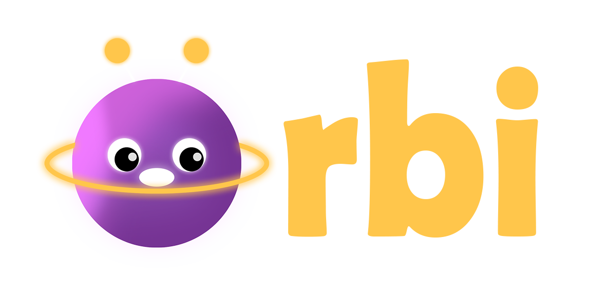

# 🪐 Orbi — Tu universo de inteligencia

<p align="center">
  
</p>

<p align="center">
  <strong>La primera app educativa que adapta el aprendizaje al tipo de inteligencia único de cada niño.</strong>
</p>

<p align="center">
  
  
  
  
  
  
</p>

<p align="center">
  <em>Construido en 36 horas para el <strong>MLH Hackathon Troyano 2026</strong> 🏆</em>
</p>

---

## 🌌 ¿Qué es Orbi?

Millones de niños aprenden de la misma forma... aunque no todos piensan igual. La ciencia lleva décadas diciéndonos que cada niño tiene un tipo de inteligencia único — pero la educación tradicional solo reconoce uno.

**Orbi cambia eso.**

Basada en la **Teoría de las Inteligencias Múltiples de Howard Gardner**, Orbi es una app gamificada donde cada inteligencia es un **planeta** que el niño descubre jugando. La inteligencia artificial observa en silencio, personaliza cada experiencia, y ayuda a los padres a entender cómo piensa realmente su hijo.

No es otro juego educativo. Es el primer sistema que **descubre el universo de inteligencia** de cada niño.

---

## 🪐 Los 8 planetas

| Planeta | Inteligencia | Cómo se explora |
|---|---|---|
| 🔵 **Kalculu** | Lógico-Matemática | Monstruos cósmicos que piden combinaciones, conteo adaptativo |
| 🟢 **Verbum** | Lingüístico-Verbal | Historias personalizadas generadas por IA, lectura en voz alta con highlighting sincronizado |
| 🩷 **Prisma** | Visual-Espacial | Construcción de naves con piezas geométricas, percepción de formas |
| 🔴 **Kinetis** | Corporal-Cinestésica | Ritmo, velocidad de reacción y movimiento |
| 🟣 **Sonus** | Musical | Secuencias musicales reales con frecuencias exactas (Do, Re, Mi...) |
| 🟢 **Terra** | Naturalista | Identificación de animales y plantas con la cámara del dispositivo + Gemini Vision |
| 🟠 **Nexus** | Interpersonal | Lectura de emociones y trabajo en equipo |
| 🟡 **Lumis** | Intrapersonal | Metas personales y autoconocimiento |

---

## ✨ Features principales

### 🎙️ Orbi Chat — una mascota con alma
Orbi no es un chatbot más. Es un **amigo espacial** con voz natural que:
- **Escucha** al niño con ElevenLabs Speech-to-Text
- **Piensa** con Gemini, usando el contexto real del perfil del niño (planetas desbloqueados, estrellas, edad)
- **Responde** con voz cálida usando ElevenLabs TTS
- **Cuida** su bienestar emocional con respuestas apropiadas ante temas sensibles

### 📖 Historias generadas en tiempo real
Cada historia es **única** — generada por Gemini con el nombre del niño como protagonista, adaptada a su nivel de lectura y al tema que él elige. La narración con ElevenLabs incluye **timestamps sincronizados** para resaltar cada palabra mientras Orbi la lee.

### 🎯 Evaluación de lectura con IA
El niño lee en voz alta. ElevenLabs transcribe. Gemini analiza precisión, fluidez y pronunciación — y devuelve un mensaje personalizado de Orbi que motiva sin regañar.

### 📊 Dashboard Parental — entendimiento real
Los papás no ven tablas aburridas. Ven:
- **Radar chart** de las 8 inteligencias con SVG puro
- **Sparkline** de sesiones recientes
- **Reporte estructurado** generado por Gemini con fortalezas reales y recomendaciones concretas
- **Exportable a PDF** para compartir con docentes o terapeutas

### 📸 Terra — identificación visual
El niño apunta la cámara a un insecto, planta o animal. **Gemini Vision** (multimodal) identifica al ser vivo y genera un dato curioso divertido, narrado con voz por Orbi.

### 🔓 Desbloqueo progresivo
Cada planeta se abre conforme el niño acumula estrellas — creando una sensación de descubrimiento y progreso constante.

### 💡 Tips motivacionales con voz
Al terminar cada sesión, Orbi genera un mensaje de voz único y personalizado con el desempeño real del niño.

---

## 🏗️ Arquitectura
┌─────────────────────────────────────────────────────────┐ │ Frontend (React + Vite + Capacitor) │ │ └─ Sistema Solar · Mini-juegos · Chat · Dashboard │ └──────────────────────┬──────────────────────────────────┘ │ HTTP / fetch ┌──────────────────────▼──────────────────────────────────┐ │ Backend (Node.js + Express) │ │ ├─ /api/story/generate → Gemini (historias) │ │ ├─ /api/story/speak → ElevenLabs TTS │ │ ├─ /api/story/transcribe → ElevenLabs STT │ │ ├─ /api/story/chat → Gemini conversacional │ │ ├─ /api/story/evaluate → Análisis de lectura │ │ ├─ /api/story/parent-report → Reporte IA │ │ └─ /api/vision/identify → Gemini Vision (Terra) │ └──────────┬───────────────┬───────────────┬──────────────┘ │ │ │ ┌────────▼──────┐ ┌──────▼─────┐ ┌───────▼──────────┐ │ Google Gemini │ │ ElevenLabs │ │ MongoDB Atlas │ │ 2.5 Flash │ │ STT + TTS │ │ Perfiles + Progreso│ └───────────────┘ └────────────┘ └───────────────────┘

---

## 🚀 Instalación y uso

### Requisitos previos
- Node.js 18+
- npm
- Cuenta en Google AI Studio, ElevenLabs y MongoDB Atlas

### 1. Clonar el repositorio
```bash
git clone https://github.com/DazaiInfinityStack/ORBI-Hackathon-Troyano-2026.git
cd ORBI-Hackathon-Troyano-2026
```

### 2. Instalar dependencias
```bash
cd backend && npm install
cd ../frontend && npm install
```

### 3. Variables de entorno
Crea un archivo `.env` en la carpeta `backend/`:

```env
PORT=3001
MONGODB_URI=tu_connection_string_de_mongodb_atlas
GEMINI_API_KEY=tu_api_key_de_google_ai_studio
ELEVENLABS_API_KEY=tu_api_key_de_elevenlabs
```

### 4. Levantar el proyecto
Necesitas **dos terminales** corriendo en paralelo:

**Terminal 1 — Backend:**
```bash
cd backend
node index.js
```

**Terminal 2 — Frontend:**
```bash
cd frontend
npm run dev
```

Abre **http://localhost:5173** en tu navegador y... ¡a explorar el universo! 🚀

### 5. Build móvil con Capacitor (opcional)
```bash
cd frontend
npm run build
npx cap sync android
npx cap open android
```

---

## 🎯 Retos del hackathon cubiertos

| Sponsor | Uso en Orbi |
|---|---|
| 🎧 **ElevenLabs** | Voz de la mascota · Narración de historias · Chat bidireccional · Tips motivacionales · Timestamps sincronizados |
| 🤖 **Google Gemini** | Historias personalizadas · Chat conversacional con contexto · Análisis de lectura · Reporte parental · Vision multimodal para identificación de seres vivos |
| 🗄️ **MongoDB Atlas** | Perfiles de niños · Historial de sesiones · Progreso por planeta · Data para el reporte parental |

---

## 🛠️ Stack completo

**Frontend**
- React 18 + Vite
- CSS animations + SVG puro para radar charts
- Capacitor para build Android
- Web Audio API para sonidos musicales reales

**Backend**
- Node.js + Express
- Mongoose para MongoDB
- Multer / FormData para manejo de audio

**IA y servicios**
- Google Gemini 2.5 Flash (texto + visión)
- ElevenLabs (TTS con `eleven_multilingual_v2` + STT con `scribe_v1`)
- MongoDB Atlas (free tier)

---

## 👥 Créditos

Un equipo de 5 estudiantes de la **Universidad Autónoma de Querétaro** que construyó Orbi desde cero durante el Hackathon Troyano 2026 — con la convicción de que cada niño merece aprender a su manera.

---

<p align="center">
  <strong>Porque cada niño tiene un universo de inteligencia por descubrir.</strong>
</p>

<p align="center">
  🪐 Hecho con ❤️ en Querétaro, México · Hackathon Troyano 2026
</p>

